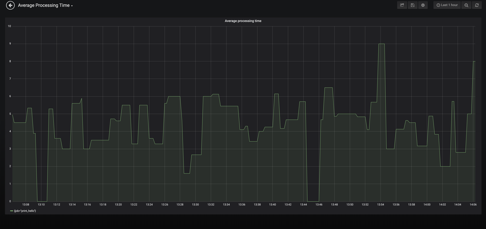
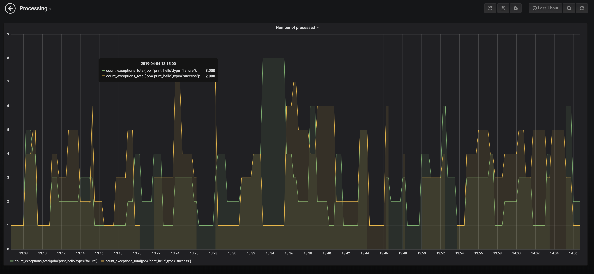

# Airflow Monitoring

## Objective
This document tells you how to enable finer pipeline monitoring on Airflow by means of integration of Prometheus, PushGateway and Grafana.
You can find an example on how to use this tools together on this [repository](https://github.com/DanielMorales9/airflow-prometheus-pushgateway). 

This document does not instruct you on how to set up the PushGateway deployment on Kubernetes


## Prometheus client
To enable custom pipeline monitoring on Grafana you need to install on your Airflow docker image the [prometheus-client](https://github.com/prometheus/client_python), which is a python client that allows you to track metrics. 
If you are using `puckel/docker-airflow` image you should just attach the ``requirements.txt`` file with the ``prometheus-client`` dependency to the docker image as shown [here](https://github.com/puckel/docker-airflow#install-custom-python-package).

Four types of metric are offered: Counter, Gauge, Summary and Histogram.  See the documentation on [metric types](http://prometheus.io/docs/concepts/metric_types/) and [instrumentation best practices](https://prometheus.io/docs/practices/instrumentation/#counter-vs-gauge-summary-vs-histogram) on how to use them.

Below, you can find a quick summary on how to use them in ``prometheus-client``.

#### Counter

Counters go up, and reset when the process restarts.


```python
from prometheus_client import Counter
c = Counter('my_failures', 'Description of counter')
c.inc()     # Increment by 1
c.inc(1.6)  # Increment by given value
```

#### Gauge

Gauges can go up and down.

```python
from prometheus_client import Gauge
g = Gauge('my_inprogress_requests', 'Description of gauge')
g.inc()      # Increment by 1
g.dec(10)    # Decrement by given value
g.set(4.2)   # Set to a given value
```

#### Summary

Summaries track the size and number of events.

```python
from prometheus_client import Summary
s = Summary('request_latency_seconds', 'Description of summary')
s.observe(4.7)    # Observe 4.7 (seconds in this case)
```

The Python client doesn't store or expose quantile information at this time.

#### Histogram

Histograms track the size and number of events in buckets.
This allows for aggregatable calculation of quantiles.

```python
from prometheus_client import Histogram
h = Histogram('request_latency_seconds', 'Description of histogram')
h.observe(4.7)    # Observe 4.7 (seconds in this case)
```


## PushGateway
The Pushgateway is an intermediary service which allows you to push metrics from jobs which cannot be scraped. You can find more details [here](https://prometheus.io/docs/practices/pushing/).

### Pushing your metrics to the PushGateway

Below, you can find a snippet on how to push your metrics to the PushGateway. 

````python
import time
from datetime import datetime
from datetime import timedelta
from random import randint, random
from timeit import default_timer as timer

from airflow import DAG
from airflow.operators.dummy_operator import DummyOperator
from airflow.operators.python_operator import PythonOperator
from prometheus_client import CollectorRegistry, push_to_gateway, Summary, Counter

GATEWAY = 'pushgateway'


def print_hello():
    registry = CollectorRegistry()
    c = Counter('count_exceptions', 'counts number of successes and failures',
                labelnames=['type'], registry=registry)
    s = Summary('time_delta', 'execution time of print_hello function', registry=registry)

    for i in range(randint(1, 10)):
        start = timer()
        time.sleep(random()*10)

        try:

            if randint(0, 1) == 1:
                raise Exception

            c.labels(type='success').inc()

        except:
            c.labels(type='failure').inc()

        end = timer()
        s.observe(timedelta(seconds=end - start).seconds)

    push_to_gateway('%s:9091' % GATEWAY, job='print_hello', registry=registry)

    return 'Hello world!'


dag = DAG('hello_world',
          description='Simple tutorial DAG',
          schedule_interval='*/1 * * * *',
          start_date=datetime(2017, 3, 20),
          catchup=False)

dummy_operator = DummyOperator(task_id='dummy_task', retries=3, dag=dag)

hello_operator = PythonOperator(task_id='hello_task', python_callable=print_hello, dag=dag)

dummy_operator >> hello_operator
````


### Configure Prometheus scaper
To allow Prometheus to scrape the metrics sitting on Pushgateway you just need to add the following configuration in the ``prometheus.yaml``

````yaml
scrape_configs:
  - job_name: pushgatewy
    honor_labels: true
    static_configs:
      - targets: ['<pushgateway-endpoint>:9091']
````

### Common Pitfalls

- When monitoring multiple instances through a single Pushgateway, the Pushgateway becomes both a single point of failure and a potential bottleneck.
- The Pushgateway never forgets series pushed to it and will expose them to Prometheus forever unless those series are manually deleted via the Pushgateway's API.

## Grafana Dashboars
You can then use Grafana to define a Dashboard based on Prometheus query language.
Use this [guide](https://prometheus.io/docs/visualization/grafana/#using) to create a dashboard.
Use this [guide](https://prometheus.io/docs/prometheus/latest/querying/basics)
for prometheus query language.

### Average processing time

### Exceptions vs Processed



## References
1. [Querying Prometheus and Grafana](https://prometheus.io/docs/prometheus/latest/querying/basics)
2. [Create a prometheus dashboard with Graphana](https://prometheus.io/docs/visualization/grafana/#using)
3. [Prometheus Metric Types](http://prometheus.io/docs/concepts/metric_types/)
4. [Prometheus instrumentation best practices](https://prometheus.io/docs/practices/instrumentation/#counter-vs-gauge-summary-vs-histogram)

## Useful links to Repository
3. [prometheus-client](https://github.com/prometheus/client_python)
4. [prometheus-client/pushgateway](https://github.com/prometheus/client_python#exporting-to-a-pushgateway)
5. [prometheus/pushgateway](https://github.com/prometheus/pushgateway)